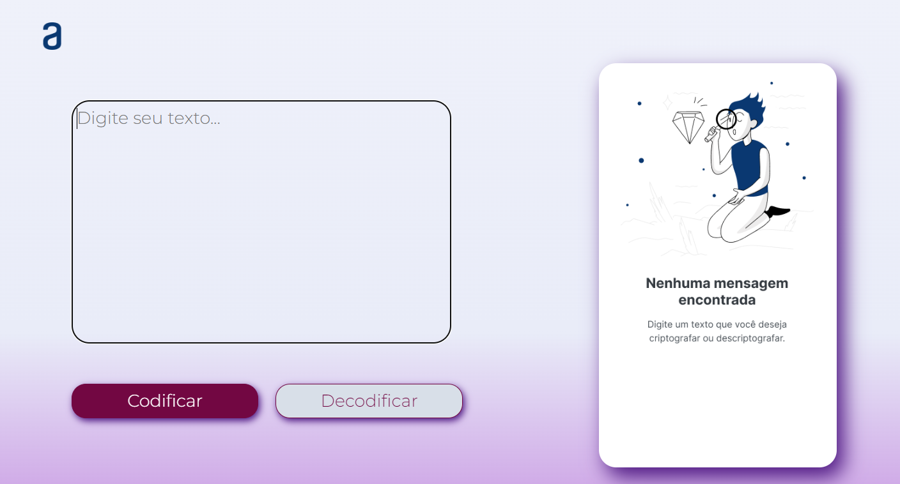

# Decodificador de Texto

## Descrição

Este é um decodificador de texto simples desenvolvido como parte de um desafio educacional. Permite criptografar e descriptografar mensagens de texto seguindo regras específicas.

## Funcionalidades

- **Criptografia e Descriptografia**: Transforma o texto usando substituições específicas.
- **Validação de Entrada**: Rejeita letras maiúsculas e caracteres especiais.

## Tecnologias Utilizadas

- HTML5
- CSS3
- JavaScript

## Como Executar

1. Clone o repositório e abra `index.html` no navegador.

## Exemplo de Uso

1. Insira o texto desejado.
2. Clique em "Criptografar" para codificar ou "Descriptografar" para reverter.
3. Mensagens de erro são exibidas se houver entrada inválida.

---

Desenvolvido por Alanis Mayra <3
